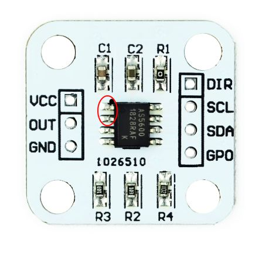
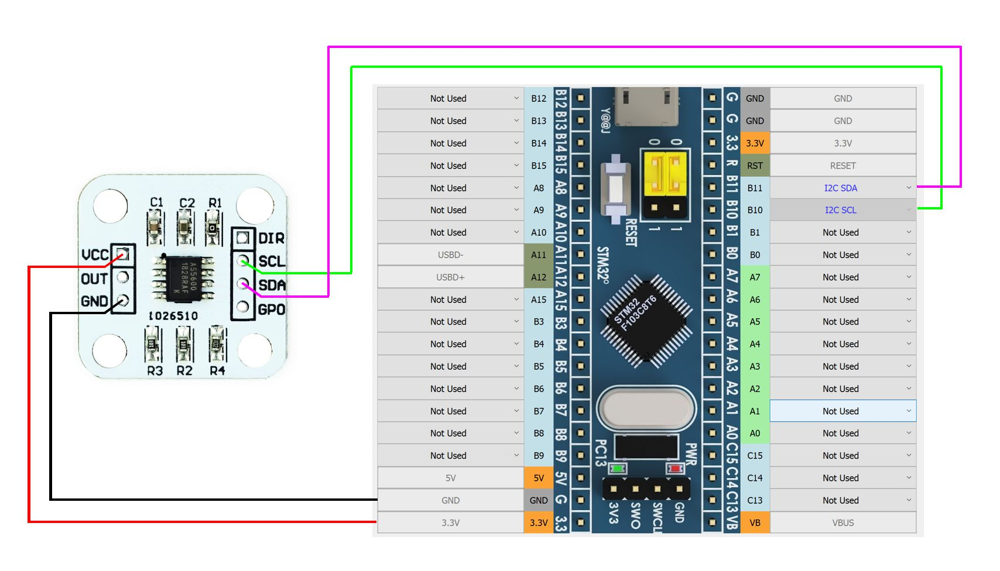
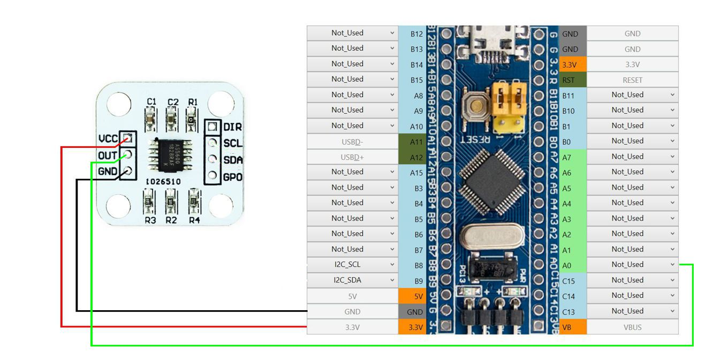

[开始页](../README.md) | [上一页](./轴的连接.md) | [English](../eng/AS5600-connection.md)

AS5600是一个单通道数字霍尔传感器。它使用I2C接口，也可以作为模拟霍尔传感器使用。这个传感器可以买到已经焊在板子上的（下图是一种这样的板子）。传感器可以使用5V或者3.3V供电，所以有必要检查传感器的功率是否合理分配在板子上。要这样做的话，你必须检查芯片的1和2触点的连接（像下图所示，第一个引脚是靠近芯片键位位置的）。如果电阻很大，这两个引脚需要手动短接。

### 使用I2C接口连接AS5600

* I2C_SCL - 时钟信号，对所有I2C设备都一样（AS5600和ADS1115 ADC）
* I2C_SDA - 数据信号，对所有I2C设备都一样（AS5600和ADS1115 ADC）

正如你在上图看到的，可以买到已经焊到了板子上的传感器。由于这个传感器在出厂时都设置了相同的地址，所以只能将一个这样的传感器通过**数字模式**连接到FreeJoy。

安装磁体的方式和[为TLE5010/5011传感器安装磁体](./TLE501x的连接.md)类似。

AS5600传感器的价格和霍尔传感器的价格接近。可以将它应用在控制控制器中最重要的轴，也就是在模拟器中使用最多的轴，当需要有最高的读数精度时也可以使用。AS5600传感器的寿命几乎是没有限制的，因为像霍尔传感器一样，它们工作时也是没有接触的。这个传感器的精度比TLE5011传感器稍微要低一些。

在[轴的配置](./轴的配置.md)部分可以找到接下来轴的设置内容。

### 将AS5600作为模拟传感器连接

正如在上图看到的，使用上图的连接，AS5600可以像正常的模拟霍尔传感器一样工作。当磁体旋转360度，输出端口（OUT）的信号电平范围为0-3.3 V。你可以连接最多8个传感器到控制器的A0-A7引脚。

*注意: 您可能需要拆除 R4 才能使传感器在模拟模式下工作*

AS5600允许你重新编程磁体的旋转角度，这样当磁体旋转一个小的角度时，传感器的输出电压就是从0 V变化到3.3 V。这样做可以让你相比传统的霍尔传感器实现更高的精度。**角度编程只能进行一次。传感器的旋转角度不能重复编程。** 因此建议在传感器已经安装在你正在组装的设备上后进行这样的编程操作。

#### 为AS5600重新编程磁体旋转角度

1. 在断开电源时（这是进入编程模式必须的），使用跳线短接PGO（GPO）引脚和地。

2. 根据校准时你打算如何从初始位置相对芯片封面旋转磁体短接DIR引脚：顺时针 - 和地短接；逆时针 - 和电源短接。

3. 供电。

4. 旋转磁体放置到初始位置。

5. 将输出引脚（OUT）和地短接。

6. 旋转磁体到另一极位置（角度必须最少有18度）。

7. 将输出引脚（OUT）和地短接。

8. 检查当磁体旋转的时候，输出信号是否变化。如果不管磁体的位置在哪，一直显示“0”，或者是加上了电源电压，那么就是出现了编程错误（比如，短接引脚时出现了“跳动”）。这样的话尝试重新从步骤4开始。

9. 移除PGO（GPO）引脚的跳线。

10. 在校准完成后，DIR的输入需要像第2步描述的那样保持和地或者电源的短接。

[开始页](../README.md) | [上一页](./轴的连接.md) | [English](../eng/AS5600-connection.md)
