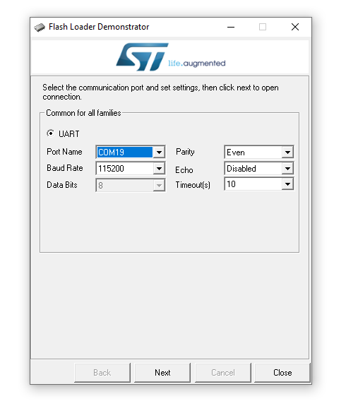
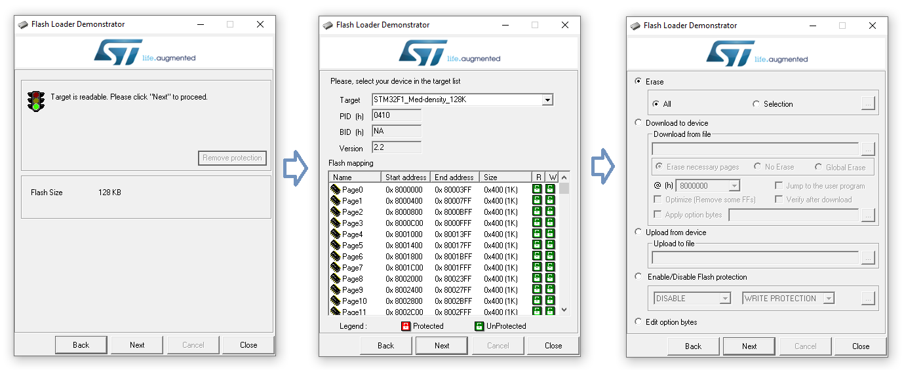
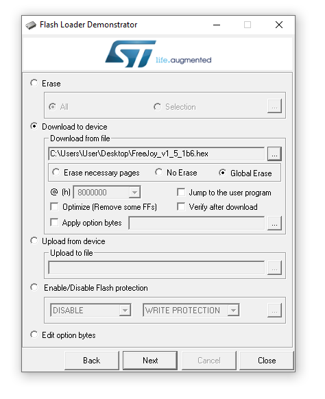

[开始页](../README.md) | [上一页](Windows下刷写固件.md) | [English](../eng/Flashing-firmware-with-USB-UART-converter.md)

1. 按照下图把USB转串口模块连接到控制板上：

2. 将控制板上的BOOT0跳线设置为1：

3. 将USB转串口模块插到电脑的USB口上。

4. 运行STM的串口烧写程序STM32 Flash Loader Demonstrator。

5. 选择USB转串口模块的COM端口（端口号可以在电脑的设备管理器中的“端口（COM和LPT）”中找到），然后点击“Next”：

6. 如果出现设备保护被激活的情况，点击“Remove protection”去除设备保护。如果没有出现的话，一路点击“Next”下一步，直到出现选择烧写方式的界面：

7. 选择“Download to device”，然后在“Download from file”选择需要烧写的FreeJoy固件（.hex文件），同时把“Global erase”选项勾上：

8. 点击“Next”开始烧写，等待烧写结束。

9. 将控制板的BOOT0跳线重新设置为0，将控制板的所有连线断开。

10. 用microUSB线将控制板连接到电脑上，然后可以在电脑上看到显示为游戏控制器的FreeJoy设备。

[开始页](../README.md) | [上一页](Windows下刷写固件.md) | [English](../eng/Flashing-firmware-with-USB-UART-converter.md)
