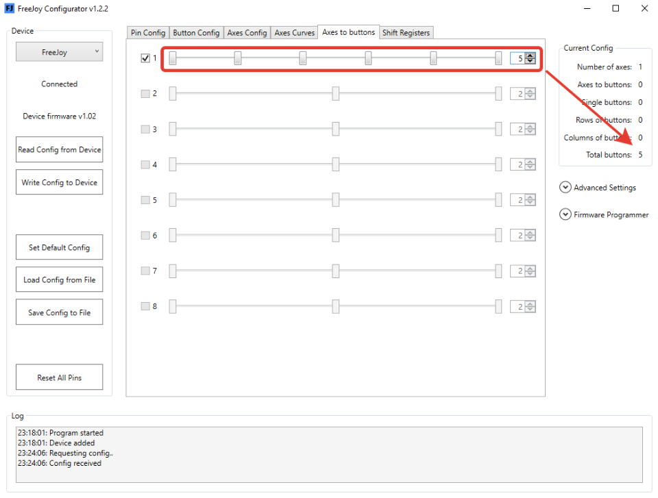

Since version v1.01 Axes to buttons feature is available.

AxisToButton function can be set to any of enabled axes. To enable this function just check it on the **Axes to buttons** tab:

You can define up to 12 buttons per axis and set their analog value ranges. These buttons will be added to the end of list of physical buttons.

All analog inputs settings like calibration and curve shapes are still functional, AxesToButtons is a layer over standard axis logic. To learn more about axis configuration see [analog inputs configuration page](Analog-inputs-configuration.md).