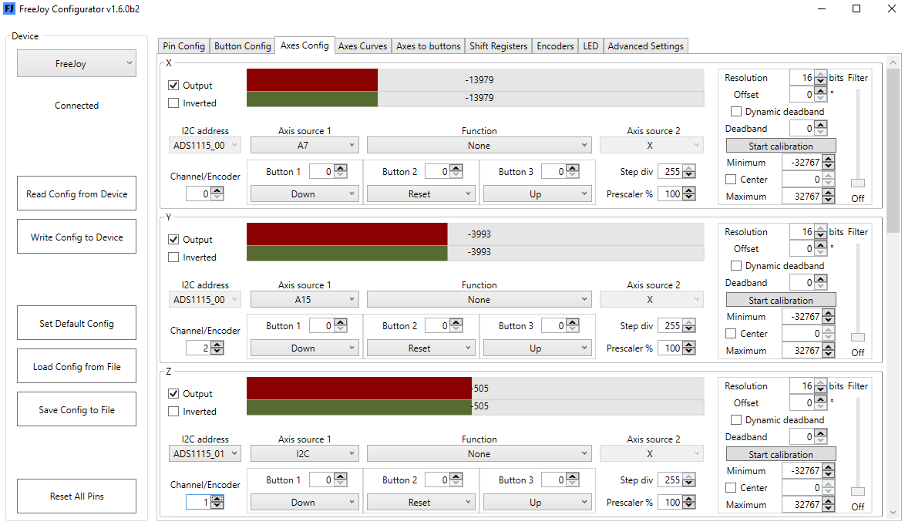

## Assignment of logical axes:

 
Like physical and logical buttons we must assign physical axes to the necessary logical axes.

The name of the analog axis output is indicated in the upper left corner of the field of this axis. There can be 8 axes in total: X, Y, Z, Rx, Ry, Rz, Slider1, Slider2.

You can assign any physical axis to any logical axis in the "Axis source 1" field. Wherein:
* for analog physical axes ([potentiometer](Potentiometer-connection.md) or [Hall sensors](Hall-sensors-connection.md)) the designation will be the signal contact (middle contact of the potentiometer or the signal output of the Hall sensor, in the example an analog sensor is assigned to the X axis, the signal contact of which is connected to A7)
* for digital SPI sensors ([TLE5010/5011](TLE501x-connection.md), [MLX90393](MLX90393-connection.md), external ADCs [MCP32XX](Connecting-analog-axes-to-MCP320x.md)) - chip select contact (in the example, the MLX90393 sensor whose SC pin is connected to A15 is assigned to the Y axis)
* for digital I2C sensors ([AS5600](AS5600-connection.md), external ADCs [ADS1115](Connecting-analog-axes-to-ADS1115.md)) - the name of the I2C interface is indicated, and field "I2C address" indicates the type of sensor and address (for [ADS1115](Connecting-analog-axes-to-ADS1115.md)) specified by connecting the ADDR pin (in the example, the external ADC [ADS1115] is assigned to the Z axis (Connecting-analog-axes-to-ADS1115.md) with address 01)

In addition for multi-channel sensors ([MLX90393](MLX90393-connection.md)) and ADC ([ADC ADS1115](Connecting-analog-axes-to-ADS1115.md) and [MCP32XX](Connecting-analog-axes-to-MCP320x.md)) in the "Channel/Encoder" field, specify the channel number (channels are numbered from 0) from which we want to receive data. (in the example on the Y-axis, we take readings from the second channel of the sensor [MLX90393](MLX90393-connection.md), and on the Z-axis from the first channel of the external ADC [ADS1115](Connecting-analog-axes-to-ADS1115.md) with address 01).
In case of encoder source you should specify encoder number from "Encoders" tab.

For unused axes in the project, uncheck Output enabled.
** Unused axes will not be displayed by the operating environment if the “Dinamic HID config” checkbox is set to the [HID Settings](Advanced-settings.md) **

The red scale "Out" shows what values ​​of the logical axis are issued to the operating system, the green scale "Raw" shows what values ​​of the physical axis the controller receives from the sensor.

## Axis calibration.
After assigning the axes, the axes must be calibrated (to make the full stroke of the physical axis correspond to the full stroke of the logical axis).
### Calibrate an axis without a center.
1. Press the Start calibration button.
1. Move the axis from one extreme position to another.
1. Press the Stop calibration button.
1. Uncheck the “Center” checkbox.
1. Record calibration results to the controller.
### Calibrate an axis with a center.
1. Press the Start calibration button.
1. Move the axis from one extreme position to another and leave it in the central position.
1. Press the Stop calibration button.
1. Record calibration results to the controller.
### Calibration of the TLE5011 Digital Sensor with Range Offset.
If you installed a digital sensor and when moving it from one extreme position to another, the physical value of the axes pass through zero (i.e., they grow to the maximum value, reset to zero and continue to grow from zero), it is necessary to shift the range of sensor readings:
1. In the field of the logical axis put a daw "Offset".
1. Set “Offset” to 180.
1. Write settings from the controller.
1. Check by moving the axis that now the axis does not pass through zero.
1. If necessary, if the axis still passes through zero: correct the values ​​of the “Offset” field, repeat steps 2-5.
1. Calibrate an axis as described above for axes with or without a center.
## Additional axis settings:
The following settings are available in the field of each logical axis:
* Inverted - inverts the logical axis (the axis will be adjusted in the opposite direction);
* Resolution - resolution of the axis in bits. Moreover, the number of samples per axis movement range will be 2 to the extent indicated in the Resolution field. For analog axes, as a rule, values ​​of no more than 12 make sense. For digital sensors, you can increase the resolution to 16 (65536 samples);
* Dinamic Deadband - setting for the axis of the dynamic deadband. The dynamic deadband value is indicated in the Deadband field below. In this case, changes in the value of the axis n will not be taken into account by a value not exceeding the value of the Deadband field. To eliminate axis jitter, it makes sense to gradually increase the values ​​of the dynamic meter zone (not forgetting to write the configuration to the controller each time the value is changed) until the values ​​of the logical axis cease to change spontaneously in the absence of movement of the physical axis. When the “Dynamic deadband” box is unchecked, the specified deadband size is applied to the central deadband;
* Filter - a slider that allows you to specify an axis filter. It can be: Off, Level1 ... Level 7. Moreover the higher the filter value the greater the lag of the change in the values ​​of the logical axis behind the physical axis, so for critical axes it is not recommended to set the filter to a value higher than Level 3;
* Prescaler - you can set this value from 1% to 255% to scale your axis output;
* On the Axis Curves tab, you can specify a pattern of change in the values ​​of each logical axis from a physical one other than linear. You can use the predefined curves (linear dependence (default), exponential, inverse exponential, arbitrary curves) or edit any of these curves by moving the slider corresponding to each point up / down.
## Combined axes functions:
In the Function field, you can specify the method of adding / subtracting two axes.

In this case, the first source is the physical axis (indicated in the Axis source 1 field (hereinafter in the AS1 formulas), the second is the logical axis (indicated in the Axis source 2 field (hereinafter in the AS2 formulas).
The following functions are available:
* Plus_Absolute = (AS1 + AS2) / 2
* Plus_Relative = (AS1 + AS2) +32767
* Minus_Absolute = (AS1-AS2) / 2
* Minus_ Relative = (AS1-AS2) -32767
* Equal AS1 = AS2

## Buttons for axis functions

It is possible to set up to 3 buttons for each axis for these functions:

* Down - decrement axis value by value 32768/Step_Divider
* Up - increment axis value by value 32768/Step_Divider
* Reset - reset axis value modificatioin
* Center - set current raw axis value as output 0 value
* Function_Enable - enable combined axes function for this axis
* Prescaler_Enable - enable prescaler for this axis

It is also possible to configure [converting the movement of axes to button presses](Axis-to-buttons-function.md)
