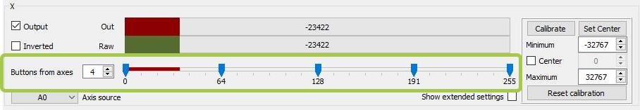
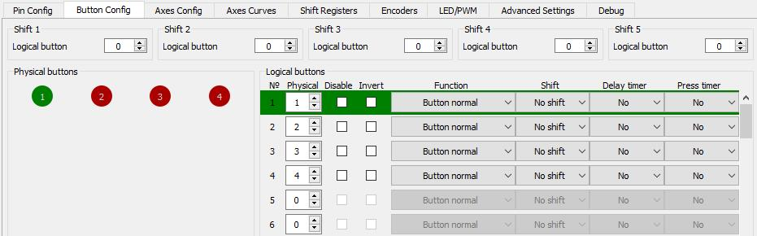

The Axis to Buttons tab is used to assign generation of button press in certain position of the axis.

 
* Left checkbox with the number of the axis. Checkmarking it includes the Axis to buttons function for the specified axis.
* On the right field, you can set the number of intervals for which buttons will be assigned.
* The axis scales are graphically shown in the middle, the minimum axis value on the left, and the maximum on the right. The sliders allow you to specify the limits in which the button will be pressed.

The corresponding number of physical buttons (for this example 4 pieces) will be added in the Phisical Buttons field of the Button Config tab:

 
With these settings the logical button 1 will press at the beginning of the axis (stop the engine), logical button 2 a little later (low gas), and a logical button 4 at the end (afterburner). The axis readings will also be transmitted to the operating system if Axis enabled checkbox is checked on Axis config tab.
