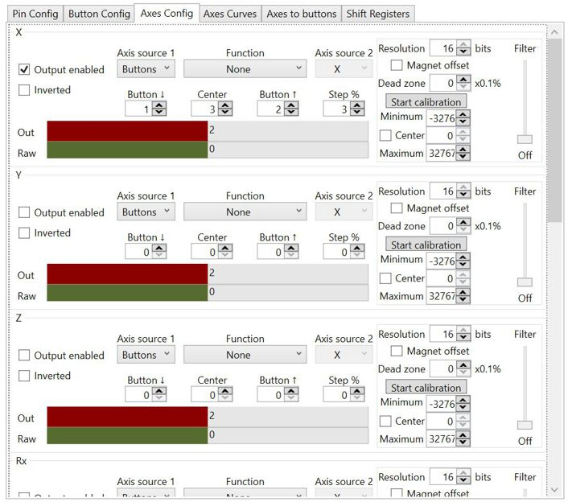

This feature may be useful when the value of any axis needs to be changed by any two buttons or including encoders.

 
1. Set Buttons as Axis source
1. In the Button ↓ field, select the logical button that will decrease the value of the axis. Button ↑ - a logical button that will increase the value of the axis. Center - will put the axis in the middle (usually the encoder button is assigned to this function). Step - percentage step with which the axis value will be changed for each click of the encoder or button press.
