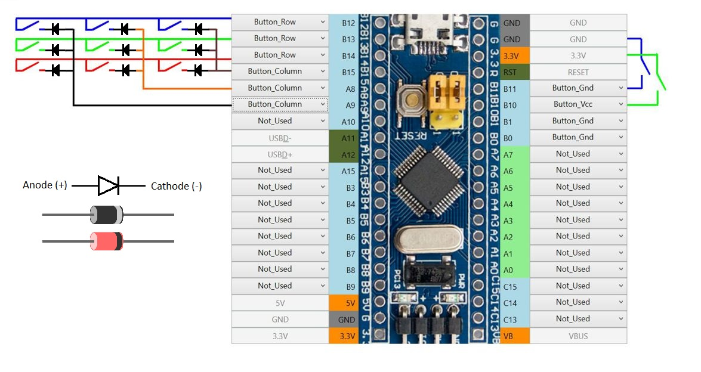
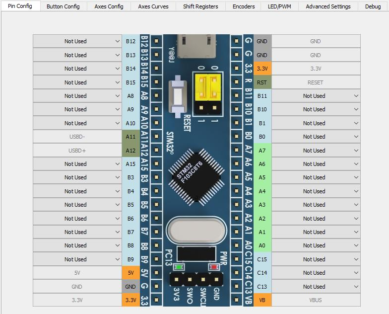
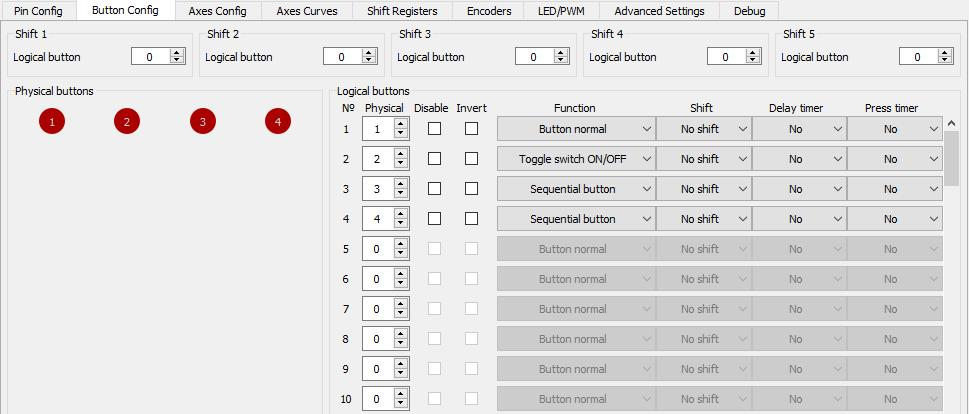

### 1. An example of connecting buttons in the figure below:

Where: - Diode 1N4148 (or any other)

### 2. Assignment of controller contacts (Pin Config tab):

Without using shift registers buttons can be connected in three different ways:

Single buttons (the number of buttons assigned in this way is displayed in the Single Buttons line of the Current Config field on the right side of the configurator):
* Button_Gnd - a button connects this contact to 0 (contacts with 0 power are marked “G”)
* Button_Vcc - a button connects this contact to the power contact (power contacts are marked “3.3”)

Using a matrix of buttons, where:

* Button_Row and Button_Column - rows and columns of the matrix, respectively. The number of rows and columns of the matrix is ​​listed in the Rows of buttons and Columns of buttons rows of the Current Config field on the right side of the configurator. In this case, the number of matrix buttons can be calculated by multiplying the number of rows and columns.

All buttons (simultaneously) can be set to bounce time - ["Button debounce time" field of the Advanced Settings section]. In this case, pressing the button shorter than the time specified in this field is not taken into account. Increasing this parameter allows you to avoid repeated operation of the buttons with a single press, if the buttons are of poor quality.

### 3. Assignment of logical buttons (Button Config tab).

Basic definitions:

* Physical button - a physically existing pair of contacts connected in some way to the controller (a single button, a button from the button matrix, a button connected to the shift register, or a toggle switch connected using one of these methods). The list of Physical buttons and their status (red - released, green - pushed) can be seen in the Physical Buttons field of the Button Config tab.
* Logical button - information transmitted to the computer about pressing a button. A list of logical buttons, physical buttons assigned to them, button functions, and the shift modificators assigned to them is displayed in the Logical Buttons field of the Button Config tab.

1. On the Button Config tab, in the Logical buttons field in the line with the number of the logical button, you must specify the corresponding number of the physical button. (You can find out the number of a specific physical button by pushing it. In the Physical Buttons field, the circle with the number of pressed physical button is highlighted in green)

After assigning a logical button and writing the configuration to the controller, you can check its operation. When you press the physical button the line with the description of the logical button will be highlighted in green in accordance with the logic of the button function. one physical button may be binded to any number of logical buttons.

2. Button function:
* Button_inverted - inverted button (if physical button pressed, then logical button pressed. And vice versa);
* Button_normal - a normal button;
* Button_Toggle - toggle button, pressing of physical button inverts the state of the logical button (If the logical button was not pressed, then pressing the physical button will make it pressed until the physical button is pressed again).

Functions for toggle switches:
* ToggleSwich_OnOff - closing and opening contacts of the toggle switch connected to the physical button generates pressing of the logical button [(the time while the logical button remains pressed is set in the Toggle Press Time field of the Advanced Settings section)](Advanced-settings.md);
* ToggleSwich_On - closing contacts of the toggle switch connected to the physical button generates pressing of the logical button [(the time while the logical button remains pressed is set in the Toggle Press Time field of the Advanced Settings section)](Advanced-settings.md);
* ToggleSwich_Off - opening contacts of the toggle switch connected to the physical button generates pressing of the logical button [(the time while the logical button remains pressed is set in the Toggle Press Time field of the Advanced Settings section)](Advanced-settings.md);

Functions for HAT switches (multi-position buttons/hats):
* PovX_Down, PovX_Up, PovX_Left, PovX_Right (where X is the number of the hat) - pressing the direction down/up/left/right of the corresponding hat.

Radio Button Function:
* RadioButtonX (Where X is the number of the group of radio buttons) - all buttons belonging to one group of radio buttons will work as follows: When you press any of the physical buttons of the group all logical buttons of the group are released and only the logical button associated with the pressed physical button remains pressed. The logical button remains pressed until another physical button from this group is pressed. When the controller is turned on, the first radio button in the list will be turned on. Radio buttons can be used as shift modificators.

* Sequental_Button - sequential switching mode - assigning one physical button to several logical ones with the enumeration function, when the physical button is pressed, the current pressed logical button will be released and the next logical button from the list will be pressed.

Eco Encoder Features:
* Encoder_A, Encoder_B - see [Connecting encoders](Encoders-connection.md)

### 4. Using shift modificators:
Any logical button can be used as shift modificator. In this case, the logical button to which the shift modificator is assigned will work if two conditions are met: the logical button that is assigned by the shift modificator in the pressed state, and the logical button to which the shift modificator is assigned in the pressed state. If physical button has both logical buttons with shift modificator and without them, then the logical button which has no modificator will work only if shift modificators are not pressed.

### 5. Checking the operation of buttons
Finally, the operation of the buttons can be checked: 
(for Windows 10) “Start”, “Settings”, “Devices”, “Devices and Printers” with the right button on the device, “Settings for game control devices”, select the device, “Properties”. 
For the number of buttons over 32 you can use VKB_Btn Tester program which is available [here](../3rd-party/software/).