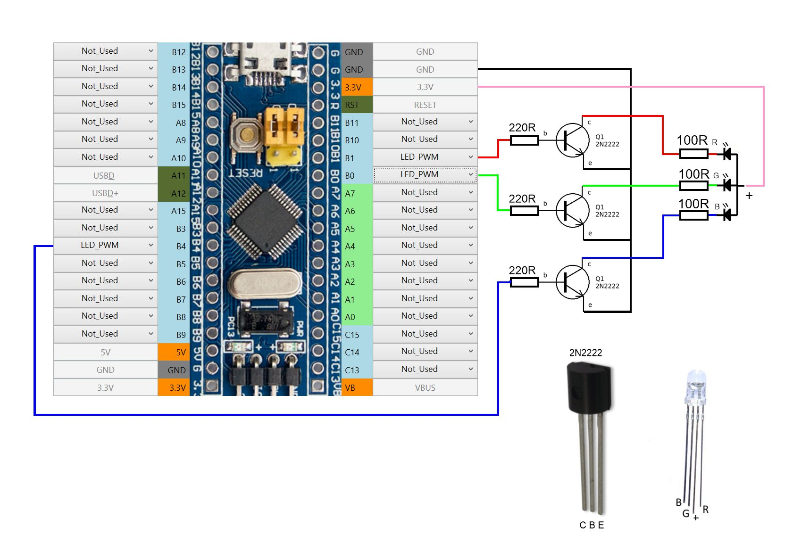

[Start page](../README.md) | [Previous level](LED-connection.md)

## RGB LEDs connection:

FreeJoy allows you to connect LEDs to four channels with adjustable brightness. If the current through the LED does not exceed 20 mA, then it is allowed to connect as a single [mono-color LED](Mono-LED-configuration.md) to contacts A8, B0, B1, B4 (since only these contacts can be adjusted for the brightness of the glow) and assigning them to LED_PWM as shown in the figure below.

If you plan to use powerful LEDs, you need to connect them via transistors (2N2222 or similar). The figure above shows the connection diagram of an RGB LED with a common anode (shown in the figure). When applying a voltage of different levels to the LED contacts, you can get a different color of the LED glow.

The value of the current limiting resistances is recommended to be calculated individually for the LEDs that you will use. To do this, you can use any online calculator to calculate. It is allowed to connect several LEDs in parallel (it is necessary to put a current limiting resistor on each LED). At the same time, it should be taken into account that when all LEDs are turned on, the total current flowing through them should not exceed 350 mA. If you connect the common anode of the LEDs to the 5V pin, you can increase the total current flowing through the LEDs to 500 mA. But at high currents of LEDs is better to use external power source (in this case the anodes of the LEDs are disconnected from the controller and connect to the "+" external power supply, and "-" external power source is connected to "GND" of the controller).

In the figure, the left part of the LED tab is responsible for the assignment of LEDs with adjustable brightness. Here you assign a percentage of the luminance of each channel.

[Start page](../README.md) | [Previous level](LED-connection.md)

