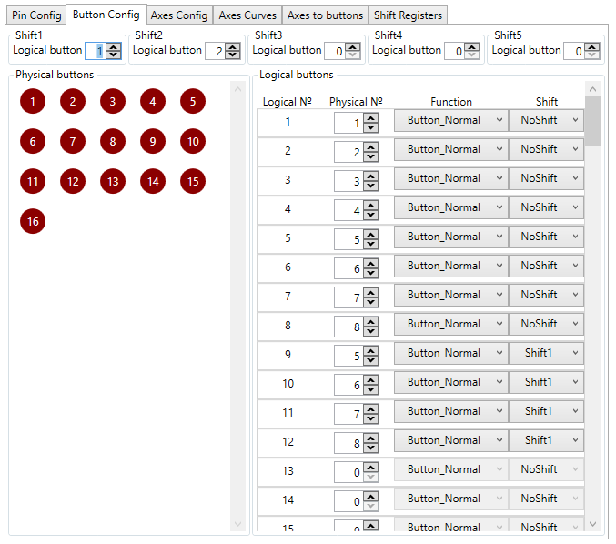
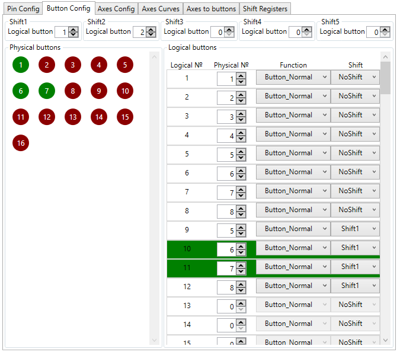
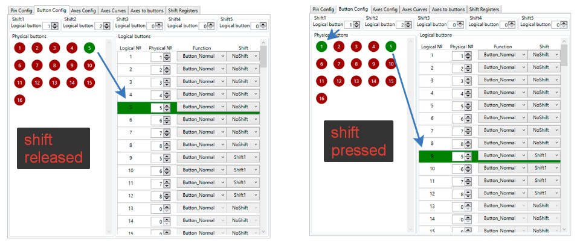
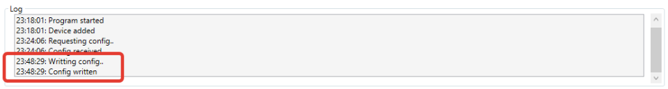

FreeJoy supports up to 128 digital inputs. Digital inputs are configured at "Button Config" tab.

Before configuring digital inputs make sure the correct pins configuration is written to the device.

## Button mappings

There are two blocks: physical and logical buttons. 

You can map up to 128 logical buttons to any of connected physical buttons. For every logical button you can choose function:

* BUTTON_NORMAL
* BUTTON_INVERTED
* BUTTON_TOGGLE
* TOGGLE_SWITCH
* TOGGLE_SWITCH_ON
* TOGGLE_SWITCH_OFF
* POV1_UP
* POV1_RIGHT
* POV1_DOWN
* POV1_LEFT
* POV2_UP
* POV2_RIGHT
* POV2_DOWN
* POV2_LEFT
* POV3_UP
* POV3_RIGHT
* POV3_DOWN
* POV3_LEFT
* POV4_UP
* POV4_RIGHT
* POV4_DOWN
* POV4_LEFT
* ENCODER_INPUT_A
* ENCODER_INPUT_B
* RADIO_BUTTON1
* RADIO_BUTTON2
* RADIO_BUTTON3
* RADIO_BUTTON4
* SEQUENTIAL_BUTTON

Some function (as encoder inputs) are not available for buttons connected as matrix or set as shifts.

### Indication

Pressed buttons will be indicated in physical and logical buttons blocks for helping you setting up your configuration.

## Shifts

You can specify up to 5 shift modificator buttons. Shifts are connected to logical buttons.

If you set shift button you can set shift modificators to your logical buttons. Physical buttons will change their logical destination to logical buttons with proper shift modificators.

## Encoders

You can connect up to 16 encoders. Both A and B encoder pin must be defined. In case of pin A defined an unused pin B with lowest number will be mapped to same encoder. Example (inputs with same color correspond same encoder):

(Screenshot from older version of configurator, but logic is the same)

## Saving changes

For applying pins configuration and saving it to the device press button **"Write Config to Device"** and wait for **"Config Written"** message appeared:

