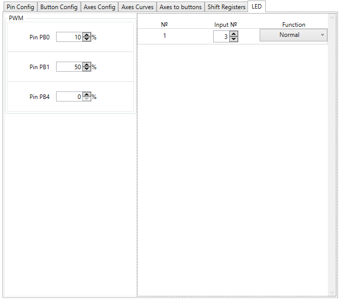

FreeJoy support 3 PWM outputs with configurable duty cycle for LED lightning and up to 24 LEDs mappable to logical buttons states. LED configuration is available at LED tab:

## PWM channels configuration

Duty cycle for each of three PWM channels can be set. If RGB LEDs are used this allows use to set custom color of highlight.

## Mappable LEDs

If LEDs connection is set at Pins tab these LEDs are available to be configured in LEDs block:

Input number is number of logical buttons which LED should be mapped to. You can choose function of LED:

* Normal - LED output is HIGH when logical button pressed
* Inverted - LED output is LOW when logical button pressed

