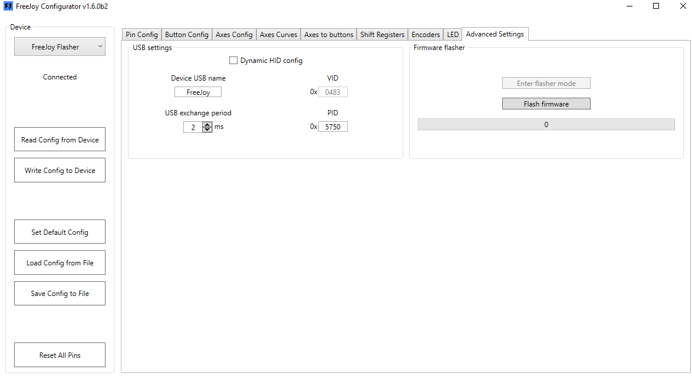
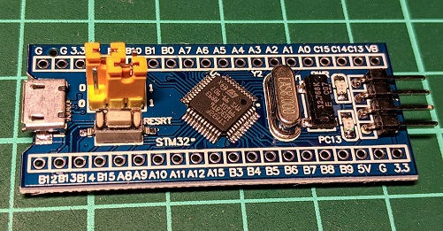

Функция загрузки прошивки позволяет обновить прошивку устройства по USB без испотльзования программатора. Эта функция работает, если контроллер уже был [прошит](Прошивка-контроллера.md) прошивкой FreeJoy при помощи программатора. Функция доступна в выпадающем меню на вкладке "Advanced settings" конфигуратора:

;

Для загрузки прошивки по USB необходимо перевести контроллер в режим загрузчика (он должен определиться системой и конфигуратором как устройтсво "FreeJoy Flasher", а на светодиод на плате контроллера должен коротко моргать). Это можно сделать двумя способами:

### Переход в режим загрузчика с помощью конфигуратора

* Подключите контроллер к ПК при помощи USB шнура;
* Перейдите на вкладку конфигуратора "Advanced settings"
* Нажмите кнопку "Enter flasher mode" и дождитесь пока контроллер переподключится как устройство "FreeJoy Flasher"

### Переход в режим загрузчика с помощью перемычки на плате

Данный способ рекомендуется если по каким-либо причинам переход в режим загрузчика с помощью конфигуратора неосуществим:

* Отключите контроллер от ПК и от других источников питания;
* На плате контроллера переставьте перемычку BOOT1 (на плате BluePill ближайшая к кнопке) в позицию 1. При этом важно чтобы перемычка BOOT0 оставалась в позиции 0:

* Подключите контроллер к ПК при помощи USB шнура и убедитесь что он определился как устройство "FreeJoy Flasher". 

### Загрузка прошивки

* Убедиться, что контроллер находится в режиме загрузчика (определен системой как "FreeJoy Flasher", на плате мерцает светодиод, а в конфигураторе разблокирована кнопка "Flash Firmware";
* Нажать кнопку "Flash firmware";
* Выбрать файл с расширением .bin из архива с необходимой вам версией [FreeJoy](https://github.com/vostrenkov/FreeJoy/releases);
* Нажать "Ok" и дождаться пока строка прогресса не достигнет 100%;
* Если вход в режим загрузчика осуществлялся с помощью перемычки, то отключите контроллер от ПК и верните перемычку в исходное положение (обе перемычки должны находиться в положении 0);

После этого ваш контроллер будет иметь новую прошивку и можно приступить к его конфигурированию.