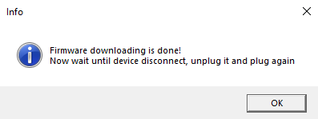

Функция загрузки прошивки позволяет обновить прошивку устройства без программатора. Эта функция работает, если контроллер уже был [прошит](Прошивка-контроллера.md) прошивкой FreeJoy при помощи программатора. Функция доступна в выпадающем меню "Firmware Programmer" в правой части конфигуратора.

Если вы хотите обновить прошивку, то необходимо:
* Подключить контроллер к ПК при помощи USB шнура;
* Нажать кнопку "Flash firmware";
* Выбрать файл с расширением .bin из архива с необходимой вам версией [FreeJoy](https://github.com/vostrenkov/FreeJoy/releases);
* Нажать "Ok" и дождаться пока строка прогресса не достигнет 100% и появится следующее сообщение:

* После этого отключите устройства от ПК на 5-10 секунд и подключите его снова.

После этого ваш контроллер будет иметь новую прошивку и можно приступить к его конфигурированию.