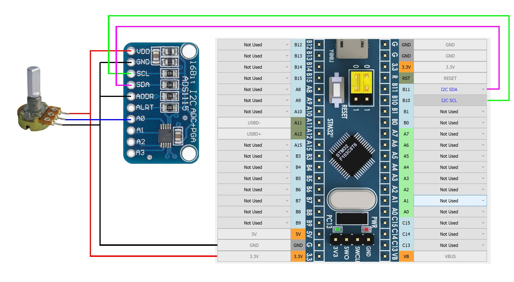

[На стартовую страницу](../README.md) | [Предыдущий раздел](Подключение-осей.md)

ADS1115 - четырех канальный аналогово-цифровой преобразователь (АЦП). Работает по интерфейсу I2C.

* I2C_SCL – Общий для всех устройств I2C (AS5600 и АЦП ADS1115)
* I2C_SDA – Общий для всех устройств I2C (AS5600 и АЦП ADS1115)

Как видно из рисунка выше АЦП можно купить уже распаянными на плату. К контроллеру можно подключить до четырех ADS1115 (при этом необходимо учитывать, что общее количество осей не должно превышать восьми). Для этого необходимо задать разные адреса устройствам. Это делается соединением вывода ADDR c другими выводами платы. Всего доступно 4 адреса: 

| Подключение вывода ADDR | Адрес микросхемы ADS1115 |
| ----------------------- | ------------------------ |
| GND                     | 1001000                  |
| VDD                     | 1001001                  |
| SDA                     | 1001010                  |
| SCL                     | 1001011                  |

Заданные платам адреса необходимо запомнить, т.к. потом они будут использоваться при [настройке осей](Настройка-осей.md).

В качестве источника аналогового сигнала могут использоваться [переменные резисторы](Подключение-переменных-резисторов.md) как на рисунке в начале страницы,  [датчики Холла](Подключение-датчиков-Холла.md) и любые другие аналоговые датчики, которые имеют выходной сигнал от 0 до 3,3В.

АЦП можно применять подключения аналоговых датчиков, если необходимо снизить число проводников для их подключения (например в рукоятке РУД, РУС) или снизить влияние наводок при большой длине проводников (в этом случае АЦП целесообразно ставить рядом с источниками аналогового сигнала). Использование медленного интерфейса I2C приводит к тому, что добавление каждого нового канала в конфигурацию увеличивает время обработки всех сигналов, поэтому необходимо использовать ADS1115 осмотрительно.

Последующая настройка осей описана в разделе [Настройка осей](Настройка-осей.md)

[На стартовую страницу](../README.md) | [Предыдущий раздел](Подключение-осей.md)

