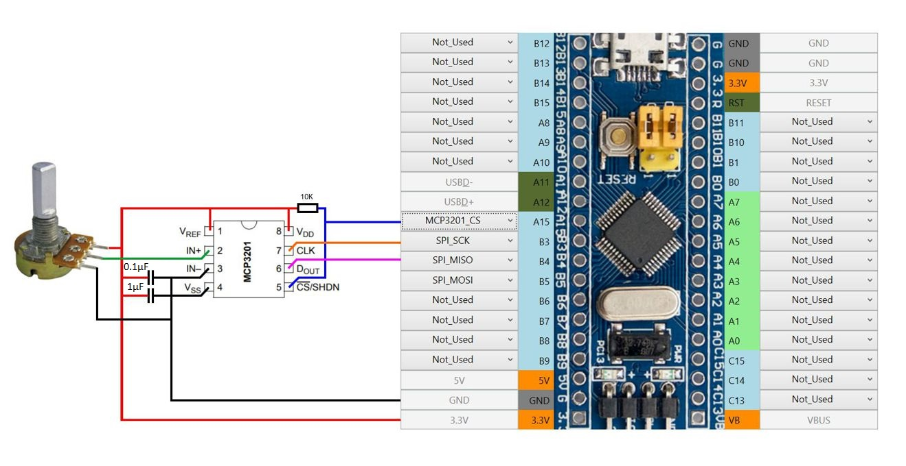

MCP32XX - семейство аналогово-цифровых преобразователей (АЦП). Последняя цифра в наименовании обозначает количество аналоговых каналов, которые возможно подключить к АЦП. Существуют одно-, двух-, четырех- и восьмиканальные модификации. Работает по интерфейсу SPI.

 
SPI_SCK – Общий для всех SPI устройств (TLE5011, MLX90393, MCP32XX и всех цепочек сдвиговых регистров);
SPI_MISO – общий для всех SPI устройств;
MCP3201_CS – индивидуальный для каждого АЦП.

Прочие модификации АЦП подключаются аналогично. Цоколевка разных модификаций MCP32XX приведена ниже:

Уже распаянные платы MCP32XX нам не встречались,поэтому мы рекомендуем либо изготовить плату самостоятельно, например, при помощи ЛУТ (лазерно-утюжной технологии).

Либо можно воспользоваться переходной платой, например такой для MCP3201 и MCP3202:

или такой для MCP3204 и MCP3208:

АЦП Выпускается в разных корпусах: DIP-8, DIP-16 - для монтажа в отверстия, SO-8, SO-16 для накладного монтажа на плату. Переходные платы, показанные выше, предназначены АЦП в корпусах SO-8, SO-16.

Конденсаторы на переходной плате можно впаять между соответствующими ножками разъема, а резистор подтяжки на стороне платы противоположной установке микросхемы между контактами соответствующими CS и +питания микросхемы.

В качестве источника аналогового сигнала могут использоваться [переменные резисторы](Подключение-переменных-резисторов.md) как на рисунке в начале страницы,  [датчики Холла](Подключение-датчиков-Холла.md) и любые другие аналоговые датчики, которые имеют выходной сигнал от 0 до 3,3В.

АЦП можно применять подключения аналоговых датчиков, если необходимо снизить число проводников для их подключения (например в рукоятке РУД, РУС) или снизить влияние наводок при большой длине проводников (в этом случае АЦП целесообразно ставить рядом с источниками аналогового сигнала).

Последующая настройка осей описана в разделе [Настройка осей](Настройка-осей.md)