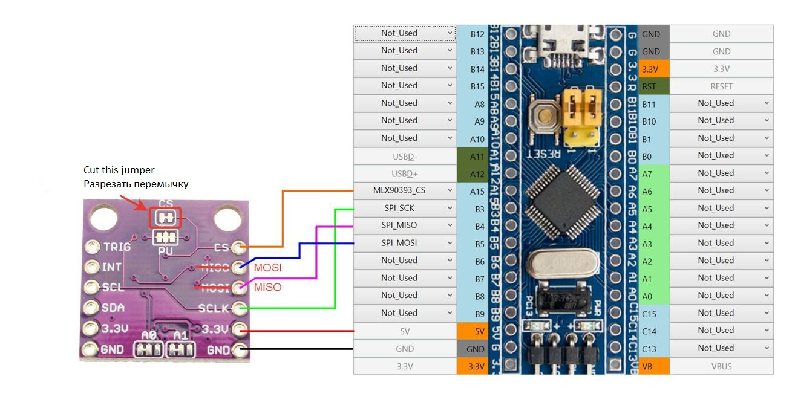
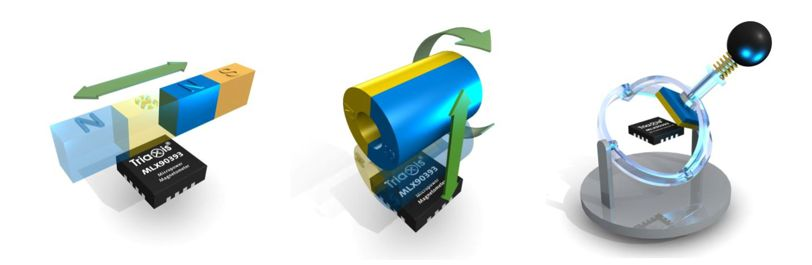

[На стартовую страницу](../README.md) | [Предыдущий раздел](Подключение-осей.md)

MLX90393 - цифровой 3-х канальный датчик Холла. Работает по интерфейсу SPI.

* SPI_SCK – Общий для всех SPI устройств (TLE5011,  MLX90393, MCP32XX и всех цепочек сдвиговых регистров);

* SPI_MISO – общий для всех SPI устройств;

* SPI_MOSI – общий для всех SPI устройств (где он требуется);

* MLX90393_CS – индивидуальный для каждого MLX90393.

  Расположение контактов контроллера которым можно назначить те или иные функции для подключения MLX90393 можно уточнить в [таблице мапинга](rus/Таблица-мапинга.md) в колонке SPI Devices.

Как видно из рисунка выше датчики можно купить уже распаянными на плату, которая подлежит минимальной доработке (см. рисунок выше).

Установка магнита для датчика аналогична установке магнитов для датчиков Холла, но необходимо учитывать, что датчик выдает положение магнита по трем осям (X,Y - движение магнита параллельно плоскости датчика и Z - перпендикулярно плоскости датчика). Возможные варианты взаимного расположения датчика и магнитов см. ниже:

Датчик MLX90393 можно применять для контроля наиболее важных осей контроллера, которые используются в симуляторах часто, и когда необходима наиболее высокая точность показаний. Учитывая то, что датчик может считывать движение магнита по двум взаимоперпендикулярным осям, возможно построение джойстика (РУС) используя всего один такой датчик. Ресурс датчиков MLX90393 практически неограничен, т.к. они являются бесконтактными как и датчики Холла.

Последующая настройка оси описана в разделе [Настройка осей](Настройка-осей.md)

[На стартовую страницу](../README.md) | [Предыдущий раздел](Подключение-осей.md)

