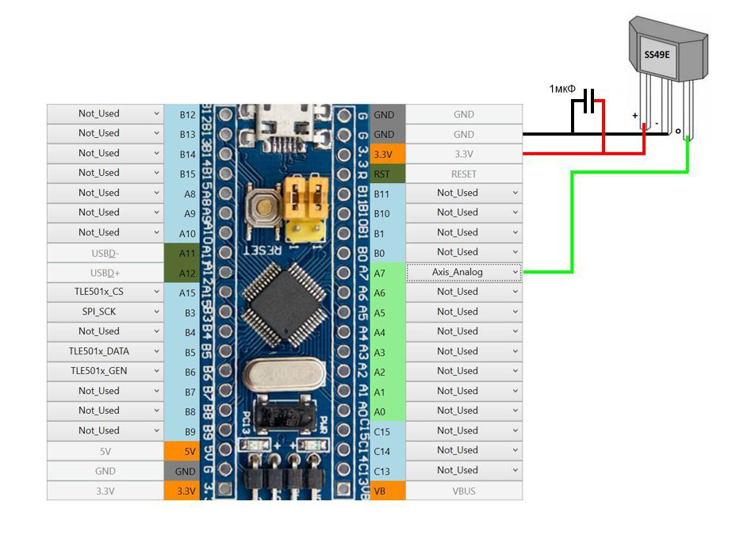
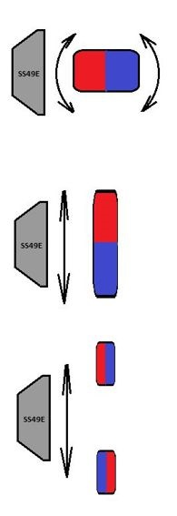

[На стартовую страницу](../README.md) | [Предыдущий раздел](Подключение-осей.md)

Как и переменный резистор, датчик Холла является аналоговым источником сигнала. Может подключаться как непосредственно к контроллеру, так и через внешние АЦП (аналогово-цифровые преобразователи) MSP32XX и ADS1115.

Пример подключения переменного резистора непосредственно к контроллеру:

Пример подключения датчика Холла:

На рисунке изображено подключение датчика Холла SS49E. Сглаживающий конденсатор рекомендуется располагать как можно ближе к датчику. Датчик Холла реагирует на плавную смену полюсов изменением напряжения на выходе (О), как потенциометр.

Возможное расположение магнита относительно датчика Холла:

Датчики Холла дороже переменных резисторов. Их рекомендуется применять для контроля тех осей, которые используются в симуляторах часто, но когда высокая точность показаний не очень важна. Ресурс датчиков Холла практически неограничен, т.к. они являются бесконтактными, но точность их показаний может быть невысока. Последующая настройка оси описана в разделе [Настройка осей](Настройка-осей.md)

[На стартовую страницу](../README.md) | [Предыдущий раздел](Подключение-осей.md)

