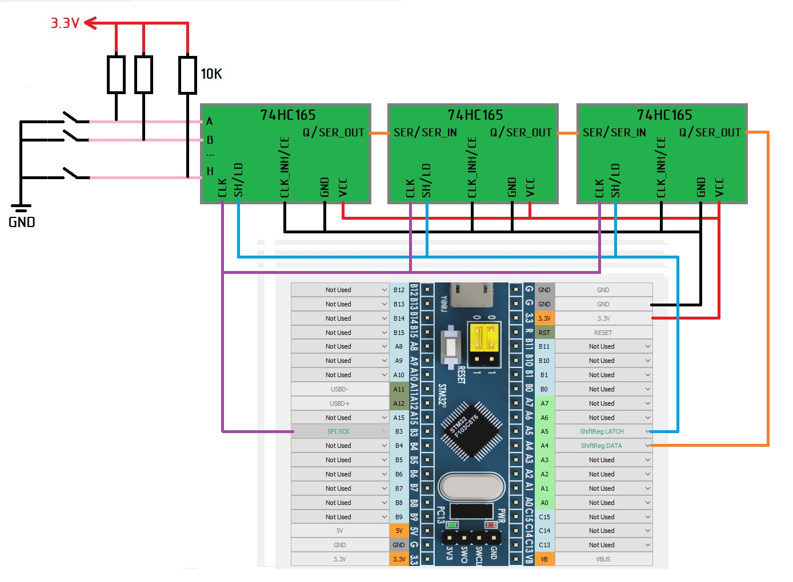

# Подключение кнопок к сдвиговым регистрам на примере сдвигового регистра 74HC165
## Проводка, назначение контактов:

Чертежи плат для сдвиговых регистров для Sprint Layout можно взять [здесь](https://github.com/FreeJoy-Team/FreeJoyConfigurator/blob/master/third_party/)
* SPI_SCK – Общий для всех TLE5011 и всех цепочек сдвиговых регистров.
* ShiftReg_LATCH, ShiftReg_DATA – индивидуальные для каждой цепочки сдвиговых регистров (Здесь к контактам A7, A6 подключена вторая цепочка сдвиговых регистров)
Питание сдвиговых регистров рекомендуется подключать от +3,3В.

## Назначение количества сдвиговых регистров.

 
Здесь к контактам А4, А5 подключено 3 сдвиговых регистра, к контактам А6, А7 – один. Задаем количество физических кнопок (количество сдвиговых регистров *8). PullUp и PullDown – тип подключения кнопок к сдвиговому регистру. Если у вас подтяжка входных контактов сдвигового регистра резистором к питанию, а сигнал нажатия кнопки – 0 на входном контакте выбираем тип подключения PullUp. Если все наоборот, то PullDown. Т.е. если вы подключили сдвиговый регистр и все кнопки в нажатом состоянии на вкладке Button Config. При замыкании кнопка из нажатого состояние переходит в не нажатое, то необходимо поменять тип с PullUp на PullDown (или наоборот).

К сдвиговым регистрам допускается подключать все виды переключателей (кнопки, тумблеры, энкодеры и т.д.). Их настройка аналогична
[Подключению кнопок непосредственно к контроллеру](Подключение-кнопок-непосредственно-к-контроллеру.md)