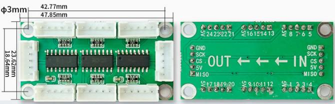
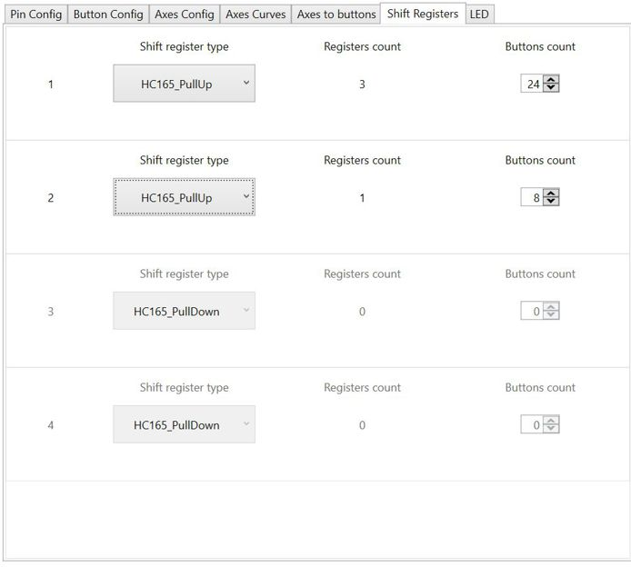
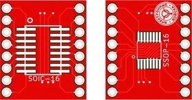

[На стартовую страницу](../README.md) | [Предыдущий раздел](Подключение-кнопок.md)

# Подключение кнопок к сдвиговым регистрам на примере сдвигового регистра 74HC165
## Проводка, назначение контактов:

Пример подключения платы сдвиговых регистров изображен ниже:

Печатную плату для сдвиговых регистров можно приобрести готовую, либо изготовить самостоятельно. 

Пример покупной платы для сдвиговых регистров:

Файл для изготовления платы самостоятельно в Sprint Layout, находится здесь https://github.com/FreeJoy-Team/FreeJoyWiki/blob/master/3rd-party/hardware/MMJoy2_74HC165.lay6

* SPI_SCK – Общий для всех TLE5011 и всех цепочек сдвиговых регистров;

* ShiftReg_LATCH - может быть общим для каждой цепочки сдвиговых регистров, либо общим для всех цепочек сдвиговых регистров;

* ShiftReg_LATCH, ShiftReg_DATA – индивидуальные для каждой цепочки сдвиговых регистров (Здесь к контактам A7, A6 подключена вторая цепочка сдвиговых регистров)
  Питание сдвиговых регистров рекомендуется подключать от +3,3В.

  На различных вариантах плат и для разных видов регистров возможны различные названия выводов. Таблица соответсвия приведена ниже:

| Имя в конфигураторе | Имя пина 74HC165 | Имя пина CD4021 | Альтернативные имена |
|---------------------|------------------|-----------------|---------------|
|       SPI_SCK       |       CLK        |      CLOCK      |     SCK               |
|    ShiftReg_DATA    |        Qh        |        Q8       |     DATA/SERIAL_OUT/OUT |
|    ShiftReg_LATCH   |       SH/LD      | PAR/SER CONTROL |     LATCH             |
|         3.3V        |        VCC       |       VDD       |     5V/V+  |
|         GND         |        GND       |       VSS       |     V-        |
|    -------------    |        SER       |  SERIAL IN      |     INPUT/DATA_IN/IN |
|    -------------    |     CLK_INH      |    ------------ |     CE |

Расположение контактов контроллера которым можно назначить те или иные функции для подключения сдвиговых регистров можно уточнить в [таблице мапинга](Таблица-мапинга.md) в колонке Shift Registers.

## Назначение количества сдвиговых регистров.

Здесь к контактам А4, А5 подключено 3 сдвиговых регистра, к контактам А6, А7 – один. Задаем количество физических кнопок (количество сдвиговых регистров *8). PullUp и PullDown – тип подключения кнопок к сдвиговому регистру. Если у вас подтяжка входных контактов сдвигового регистра резистором к питанию, а сигнал нажатия кнопки – 0 на входном контакте выбираем тип подключения PullUp. Если все наоборот, то PullDown. Т.е. если вы подключили сдвиговый регистр и все кнопки в нажатом состоянии на вкладке Button Config. При замыкании кнопка из нажатого состояние переходит в не нажатое, то необходимо поменять тип с PullUp на PullDown (или наоборот).

Возможно подключение сдвиговых регистров 74HC165 и CD4021.  Обе микросхемы выпускаются как в корпусе DIP-16 (для монтажа в отверстия платы), так и в корпусе SO-16 (для накладного монтажа на плату) Чертежи платы для самостоятельного изготовления для сдвиговых регистров 74HC165 (как в примере приведенном выше) и CD4021 в корпусе SO-16, для Sprint Layout можно взять [здесь](../3rd-party/hardware/). Так же (если у вас нет возможности изготовить плату самостоятельно), можно воспользоваться переходной платой, например, такой:

К сдвиговым регистрам допускается подключать все виды переключателей (кнопки, тумблеры, энкодеры и т.д.). Их настройка аналогична настройке кнопок подключенных непосредственно к контроллеру: [Настройка кнопок](Настройка-кнопок.md)..

[На стартовую страницу](../README.md) | [Предыдущий раздел](Подключение-кнопок.md)
