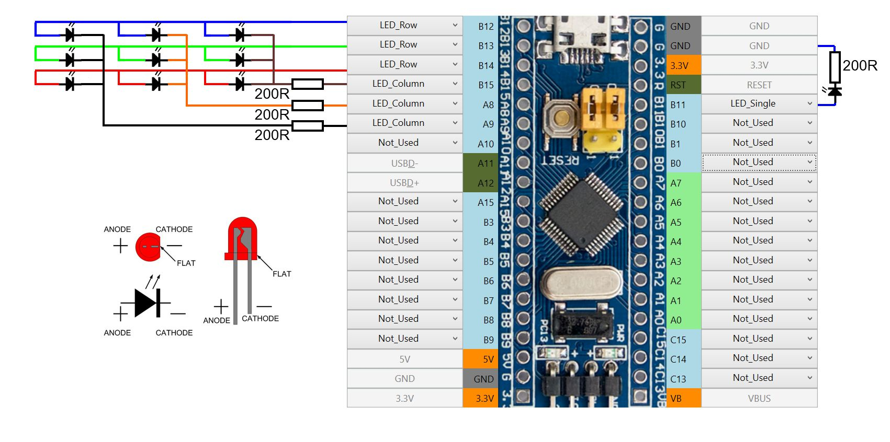
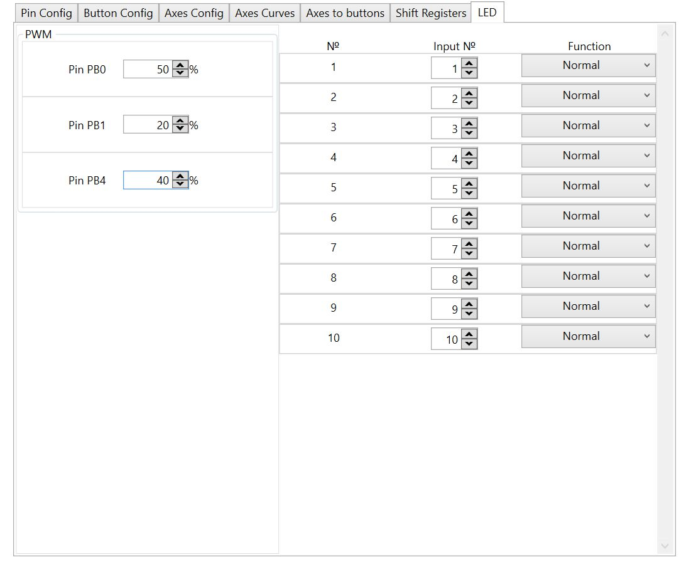

[На стартовую страницу](../README.md) | [Предыдущий раздел](Подключение-светодиодов.md)

## Подключение одноцветных светодиодов:

FreeJoy позволяет подключать светодиоды матрицей и по одному, как показано на рисунке. Величину сопротивлений, ограничивающих ток, рекомендуется рассчитывать индивидуально для тех светодиодов, которые вы будете использовать. Для этого можно воспользоваться любым онлайн калькулятором для расчета. При этом необходимо учитывать, что при включении всех светодиодов строки общих ток, протекающий через них не должен превышать 20 мА.

Если вы планируете включать мощные светодиоды, то необходимо использовать схему усиления как в примере [подключения RGB светодиодов](Подключение-RGB-светодиодов.md).

Включение светодиодов можно сопоставить состоянию логической кнопки. При этом можно дополнительно сделать светодиода инвертным относительно состояния кнопки:

На рисунке за назначение одноцветных светодиодов отвечает правая часть вкладки LED.

- № - номер светодиода;
- Input № - номер логической кнопки назначенной на светодиод;
- Function - состояние светодиода относительно состояния кнопки (нормальное или инвертированное)

[На стартовую страницу](../README.md) | [Предыдущий раздел](Подключение-светодиодов.md)

