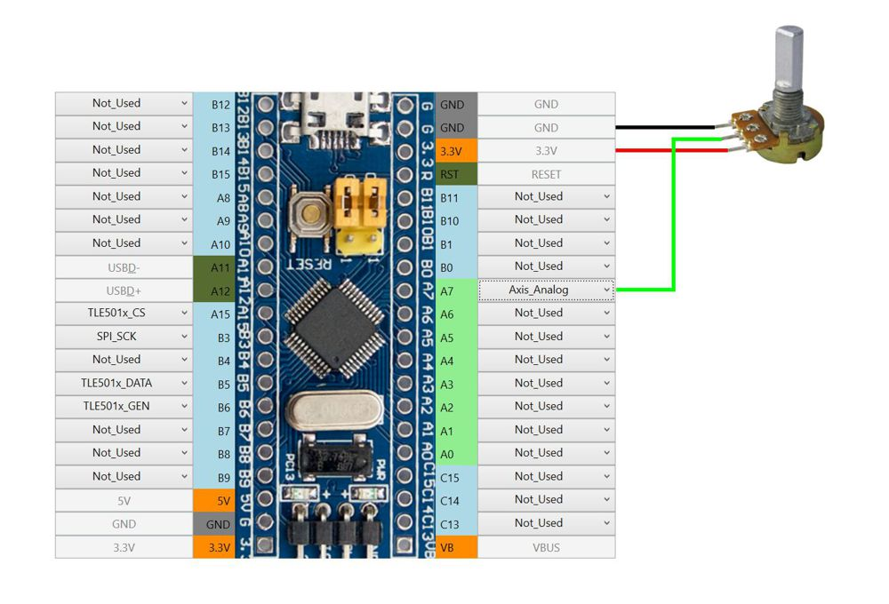

Переменный резистор является аналоговым источником сигнала. Может подключаться как непосредственно к контроллеру, так и через внешние АЦП (аналогово-цифровые преобразователи) MSP32XX и ADS1115.

Пример подключения переменного резистора непосредственно к контроллеру:

Величина переменного сопротивления для аналоговой оси – 10КОм.

Переменные резисторы являются наиболее простым, дешевым и доступным источником аналогового сигнала для игрового контроллера. Их рекомендуется применять для контроля тех осей, которые используются в симуляторах не часто и когда высокая точность показаний не очень важна. Ресурс переменных резисторов невелик и концу своей жизни (а инога и в ее начале) они начинают "шуметь", т.е. при отсутствии движения ручки сопротивление резистора хаотично меняется. Последующая настройка оси и методы уменьшения ее шума описаны в разделе [Настройка осей](Настройка-осей.md)