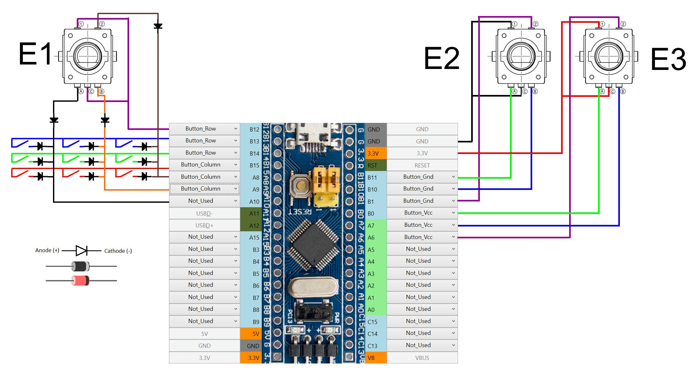
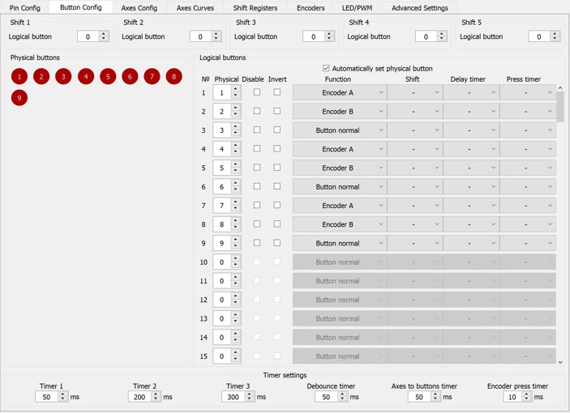
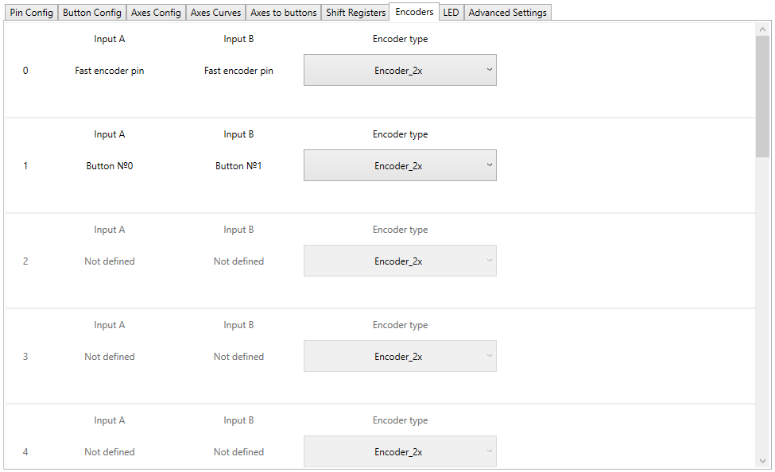

[На стартовую страницу](../README.md) | [Предыдущий раздел](Подключение-кнопок.md)

# Подключение энкодеров:

К FreeJoy возможно подключение 16 инкрементальных энкодеров, в том числе одного энкодера высокого разрешения (для контроля оси) и 15 энкодеров низкого разрешения (для контроля оси и/или работы в качестве кнопок).

Энкодеры высокого разрешения подключаются к пинам A8 и A9 платы контроллера в качестве функции "Fast Encoder". Их подключение рассматривается в другой [главе](/rus/Подключение-быстрых-энкодеров.md).

Для энкодеров низкого разрешения могут быть использованы, например, энкодеры линейки PEC11R.  Энкодеры этой линейки отличаются различным разрешением (12, 18, 14 нажатий за оборот) могут выпускаться со щелчками (тактильное изменение  усилия вращения рукоятки при прохождении нажатий) и без них, бывают с разной формой штока (с лыской или шлицами), и могут иметь или не иметь кнопки на нажатие штока.

Варианты подключения экодера с кнопкой нажатия штока изображены на рисунке ниже :

Здесь энкодер Е1 подключен к матрице кнопок, энкодеры Е2 и Е3 в качестве типа сигнала используют низкий(Button_Gnd) и высокий (Button_Vcc) уровни напряжения соответственно. Так же энкодеры можно подключать к [сдвиговым регистрам](/rus/Подключение-кнопок-к-сдвиговым-регистрам.md).

Назначаем:
* Логической кнопке 1 – физическую 1 (тип Encoder_А) (Канал энкодера А).
* Логической кнопке 2 – физическую 2 (тип Encoder_B) (Канал энкодера B).
* Логической кнопке 3 – физическую 3 (Button_Normal) (Кнопка энкодера).

Далее необходимо проверить работу энкодера на этой же вкладке конфигуратора. При вращении энкодера в одну сторону будет нажиматься кнопка 1, в другую – кнопка 2. При нажатии на энкодер будет срабатывать кнопка 3. При неоходимости откорректировать значение "Encoder press time". Рекомендуемые значения – не более 50 мс. По умолчанию установлено 10 мс.

Все подключенные энкодеры отображены на вкладке "Encoders":

На этой вкладке можно посмотреть какие входы соответствуют подключению каких энкодеров, а также выбрать разрешение, с которым осуществляется чтение сигнала с энкодера. Для энкодера высокого разрешения это значение может составлять только **2х** или **4х**, а для энкодеров низкого разрешения доступны значения **1х**, **2х** и **4х**.

Подключенные энкодеры можно использовать как самостоятельные кнопки (только энкодеры 1-15), либо как источник оси.

[На стартовую страницу](../README.md) | [Предыдущий раздел](Подключение-кнопок.md)
