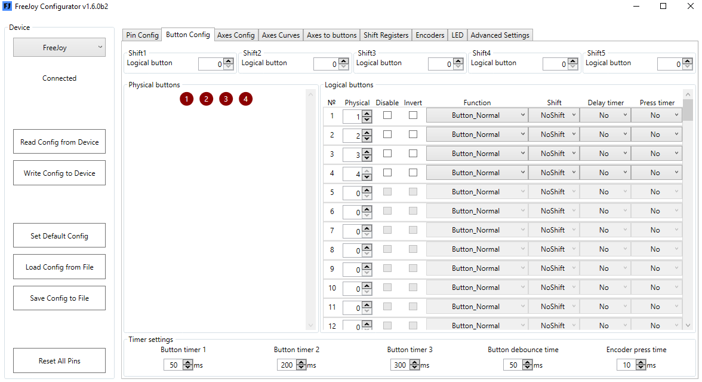

[На стартовую страницу](../README.md) | [Предыдущий раздел](Подключение-кнопок.md)

Для назначения того, что бы при определенном положении оси генерировалось нажатие кнопки служит вкладка Axis to Buttons.

 
* Слева чекбокс с порядковым номером оси. Установка в нем галочки включает функцию Оси в кнопки для указанной оси.
* Справа в поле можно установить количество интервалов для которых будут назначены кнопки.
* В середине графически изображены шкалы осей, слева минимальное значение оси, справа – максимальное. Движки позволяют задать пределы в которых будет транслироваться нажатие кнопки. (Т.е. между 1-м и 2-м движками – первая кнопка, между 2-м и 3-м – вторая и т.д.).
После этой настройки в поле Phisical Buttons закладки Button Config будет добавлено соответствующее количество физических кнопок (для этого примера 4 шт.), которые можно назначить любым логическим кнопкам:

 
При такой настройке лог. Кнопка 1 будет срабатывать в самом начале оси (заглушить двигатель), лог. кнопка 2 чуть позже (малый газ), и лог. Кнопка 4 в самом конце (форсаж). При этом показания оси так же будут транслироваться в операционную систему.

[На стартовую страницу](../README.md) | [Предыдущий раздел](Подключение-кнопок.md)
