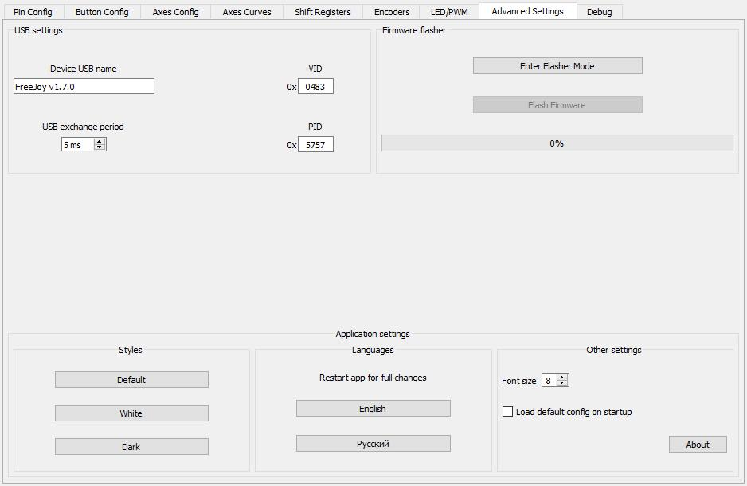

[На стартовую страницу](../README.md) | [Предыдущий раздел](../README.md)

Дополнительные настройки находятся на вкладке Advanced settings:

## HID Settings:

* VID - VID идентификатор USB устройства;
* PID - PID идентификатор USB устройства. Если вашей системе используется более одного устройства на FreeJoy, то для них рекомендуется назначать разные PID;
* USB exchange period - время между последовательной отправкой двух пакетов с данными от контроллера к ПК по USB.

## Firmware Flasher

Поле загрузчика прошивки. Подробнее о загрузке прошивки через конфигуратор смотрите здесь:

* [Загрузчик прошивки](Загрузчик-прошивки.md)

## Styles

Для программы конфигуратора возможно задать один из нескольких цветовых стилей:

* По умолчанию (Default)
* Белый (White)
* Тёмный (Dark)

## Languages

Программа конфигуратора поддерживает переключение языков интерфейса. На данный момент поддерживаются следующие языки:

* Русский
* Английский

# Other settings

В данном блоке можно изменить размер шрифта приложения, а также установить галку для загрузки конфига по умолчанию при старте приложения.

[На стартовую страницу](../README.md) | [Предыдущий раздел](../README.md)
