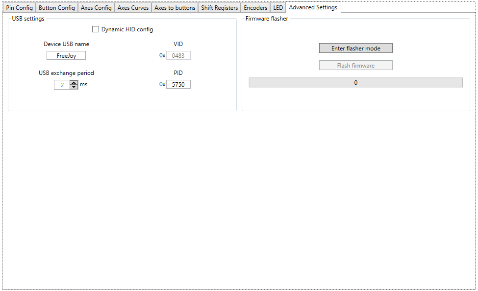

Дополнительные настройки находятся на вкладке Advanced settings:

## HID Settings:
* Dinamic HID config - динамическая конфигурация устройства. При активации этого режима ПК не будет отображать неиспользуемые кнопки и оси;
* VID - VID идентификатор USB устройства (не изменяется);
* PID - PID идентификатор USB устройства. Если вашей системе используется более одного устройства на FreeJoy, то для них рекомендуется назначать разные PID.

## Firmware Flasher

Поле загрузчика прошивки. Подробнее о загрузке прошивки через конфигуратор смотрите здесь:

* [Загрузчик прошивки](Загрузчик-прошивки.md)