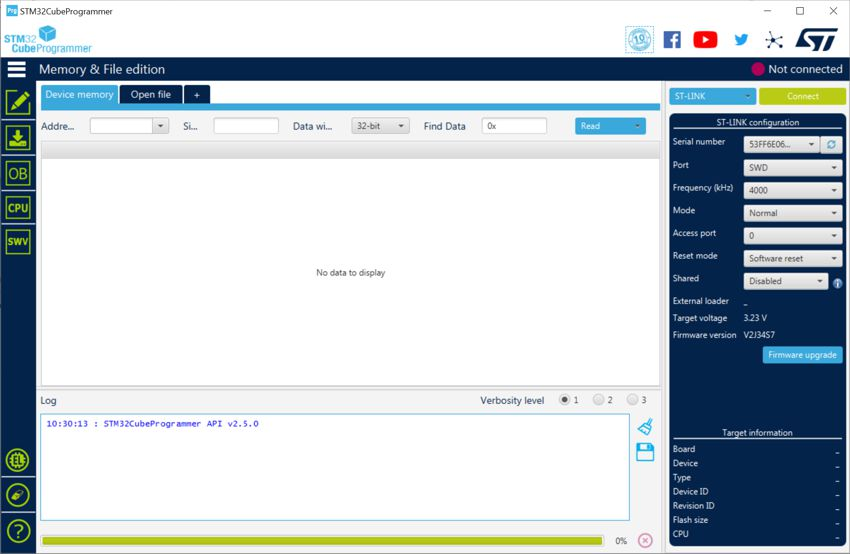
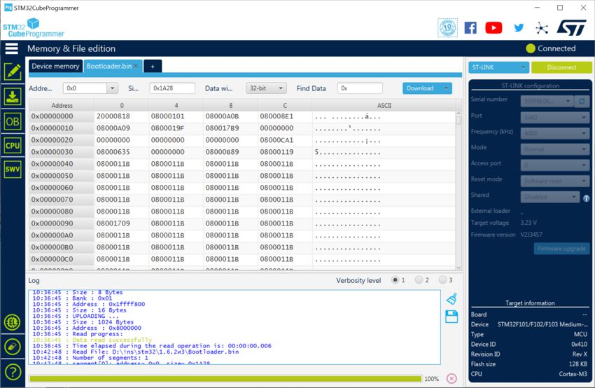

[На стартовую страницу](../README.md) | [Предыдущий раздел](Прошивка-контроллера.md)

Иногда (особенно из китайских интернет-магазинов) вместо платы с контроллером STM32F103C8 приходит плата с контроллером CKS32F103C8. Эта плата ничем не отличается от оригинальной, кроме того, что при подключении может не определяться компьютером ни до, ни после прошивки. В этом с случае необходимо записать в чип бутлоадер, как написано ниже:

Для этого понадобится:

- Плата с контроллером CKS32F103C8;
- Программатор ST-Link v2 и утилита [STM32CubeProgrammer](https://www.st.com/en/development-tools/stm32cubeprog.html#get-software) (распространяется бесплатно, для скачивания требует регистрации, для работы требует java runtime environment (если не установлен, то установщик предложит скачать и установить))

1. Подключите программатор как показано на рисунке ниже (сверяйтесь с подписями контактов на программаторе и плате контроллера):

2. Подключите программатор ST-Link v2 к компьютеру;
3. Запустите программу STM32CubeProgrammer;
4. При этом программа может пожаловаться на старую версию ST-Link. Необходимо обновить прошивку программатора (описано [здесь](Прошивка-программатора-ST-Link-v2.md)).
5. Вид окна после выполнения всех подключений:

   

6. Нажмите в программе "Connect" :

   

7. Нажмите "Open File" и выберите файл bootloader.bin из содержимого архива прошивки FreeJoy:

   

8. Нажмите "Download", по окончании загрузки будет выдано сообщение "File downoad complite"/

9. По окончании можно прошивать любым способом [через преобразователь USB-Uart, программатор ST-Link V2](Прошивка-контроллера.md) или [каебль USB](Загрузчик-прошивки.md) 

[На стартовую страницу](../README.md) | [Предыдущий раздел](Прошивка-контроллера.md) 
