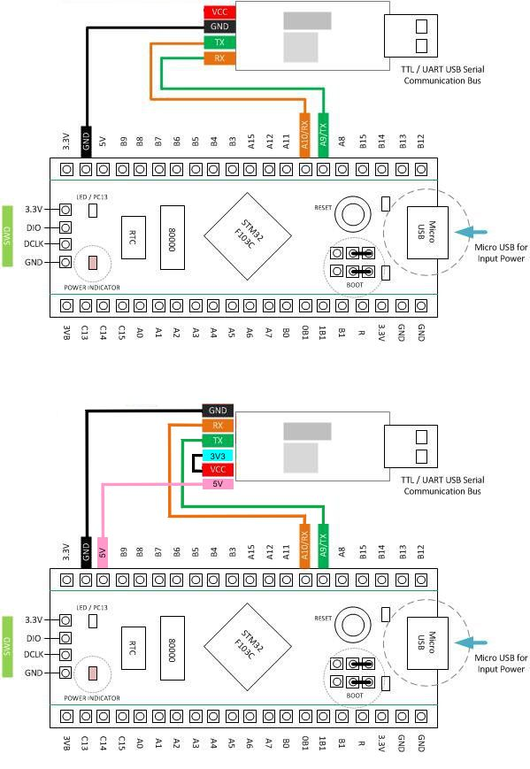
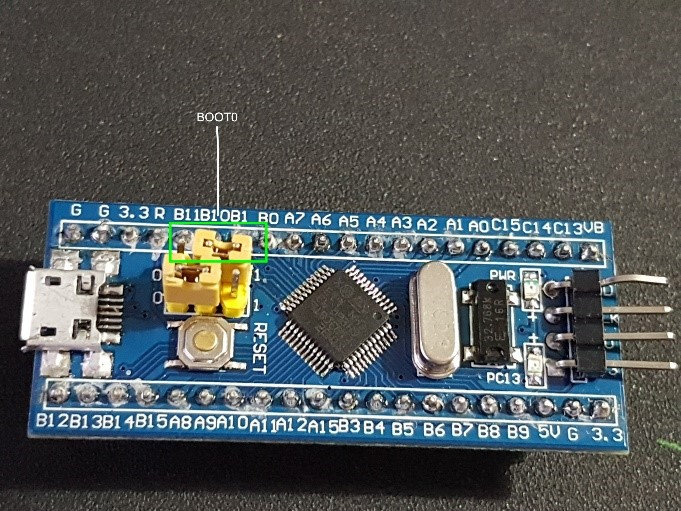

1. Подключите преобразователь как показано на рисунке ниже:

1. Установите джампер BOOT0 в позицию 1:

1. Подключите преобразователь USB-UART к компьютеру;
1. Запустите программу STM32 Flash Loader Demonstrator;
1. Выберите COM порт который был назначен вашему преобразователю (номер порта можно посмотреть в диспетчере устройств «Порты (COM и LPT)» и нажмите «Next» перед тем как выбрать файл в диалоговом окне;
1. Нажмите "Download to device" и выберите файл с расширением .hex, который расположен в архиве релиза FreeJoy;
1. Нажмите «Next» и дождитесь окончания программирования контроллера;
1. Установите джампер BOOT0 в позицию 0 и отключите все содиненения.
1. Подключите плату контроллера к компьютеру посредством MicroUSB кабеля. FreeJoy устройство определится в системе как игровой контроллер.
