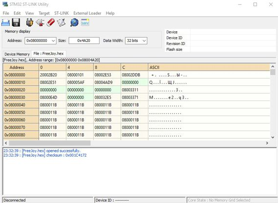
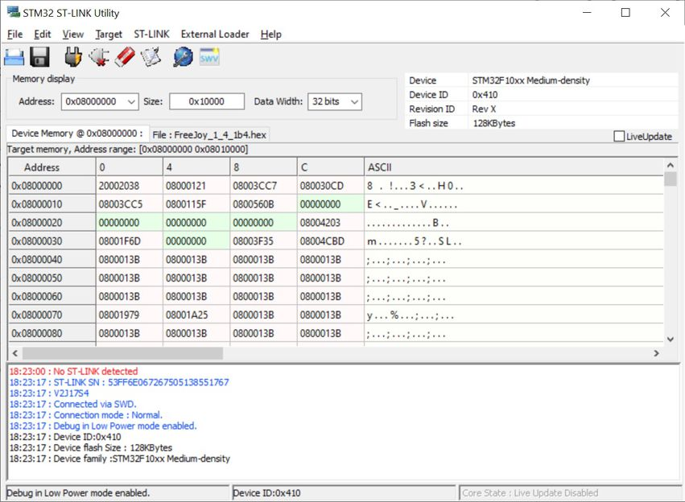
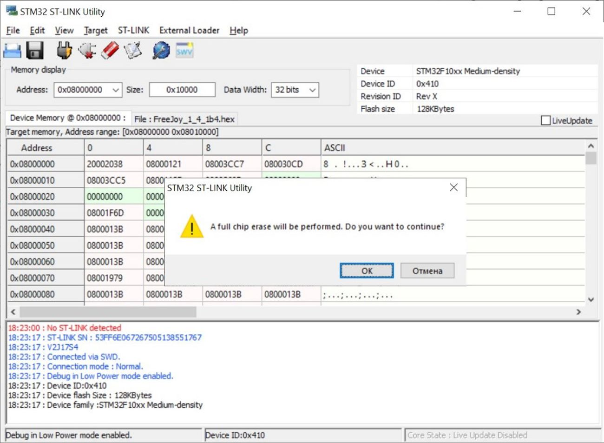
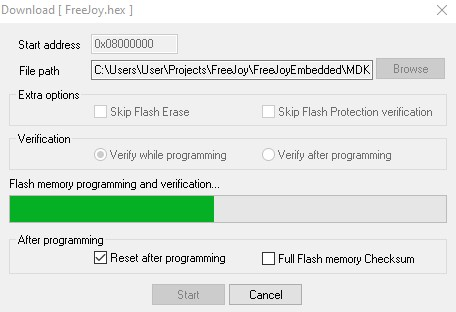

[На стартовую страницу](../README.md) | [Предыдущий раздел](Прошивка-контроллера.md)

1. Подключите программатор как показано на рисунке ниже (сверяйтесь с подписями контактов на программаторе и плате контроллера):

1. Подключите программатор ST-Link v2 к компьютеру;
1. Запустите программу ST-Link;
1. Нажмите в программе "File->Open File" и выберите файл с расширением .hex который расположен в архиве релиза FreeJoy;
1. Теперь вы увидите страницу загрузки бинарных кодов:

5. Нажмите "Target->Connect". После подключения устройства вы можете видеть такую информацию как ID устройства, размер флэш-памяти и семейство устройства в блоке сверху и просмотреть содержимое внутренней памяти в основном блоке:

На этом этапе может оказаться, что выдается такое сообщение: "STM32 cannot read memory. Disable read out protection and retry".
Для того, что бы продолжить прошивку, необходимо нажать: пункты меню "Target", "Option Bytes" в окошке "Read Out Protection" (в левом верхнем углу) заменить "Enabled" на "Disabled" и нажать "Apply".

6. Нажмите "Targert->Erase chip" и "OK" в открывшемся окне;

7. Теперь нажмите "Target->Program & Verify" и в открывшемся окне нажмите "Start". Начнется программирование контроллера:

8. После успешного программирования контроллера отключите все соединения и подключите плату контроллера к компьютеру посреством MicroUSB кабеля.
9. FreeJoy устройство определится в системе как игровой контроллер.

[На стартовую страницу](../README.md) | [Предыдущий раздел](Прошивка-контроллера.md) 
