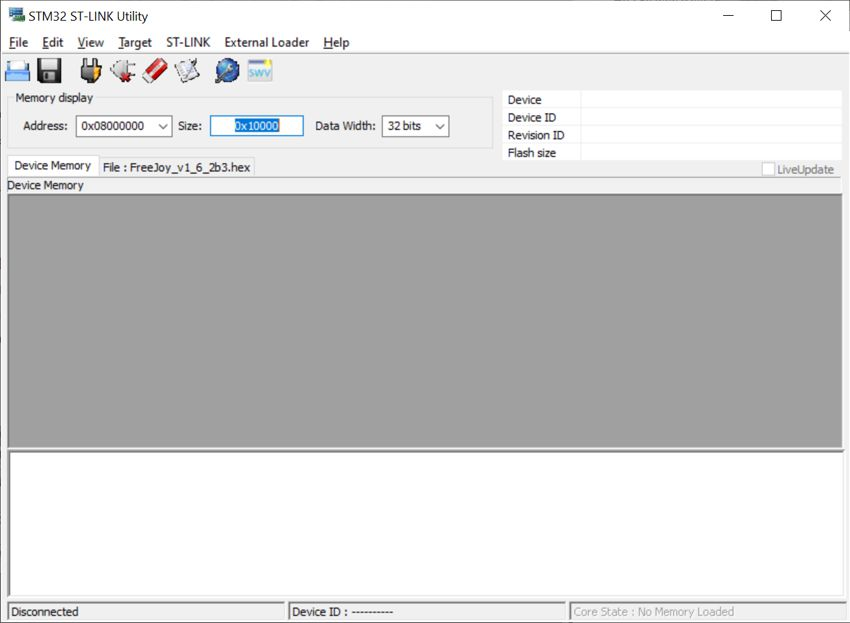
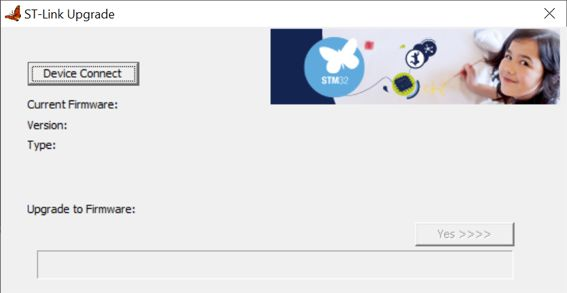

[На стартовую страницу](../README.md) | [Предыдущий раздел](Прошивка-CKS32.md)

В случае если при прошивке контроллера программа жалуется на старую версию программатора, то необходимо обновить прошивку программатора.

1. Подключите программатор ST-Link v2 к компьютеру;

2. Запустите программу ST-Link;
3. Нажмите в программе "File->Open File" и выберите файл с расширением .hex который расположен в архиве релиза FreeJoy;
4. Теперь вы увидите страницу загрузки бинарных кодов:

5. Нажмите "ST_LINK->Firmware Update".

6. Нажмите "Devive Connect" в открывшемся окне. Если появится вот такое предупреждение:

То необходимо переподключить программатор. Появится такое окно:

7. Нажать Yes>>>>:

Обновление прошивки выполнено.

[На стартовую страницу](../README.md) | [Предыдущий раздел](Прошивка-CKS32.md) 
